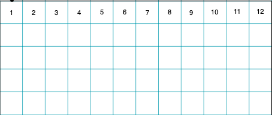
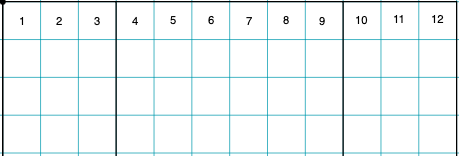

<style>
@media only screen and (max-width: 800px) {
   h1, h2, h3 {
      color: red;
      font-family: "Comic Sans MS";
   }
}
</style>
## Intro
This class is not meant to replace researching, reading, and using the Bootstrap docs to achieve responsive design in your project(s). Rather, it is meant to be a starting point for understanding the point of responsive design, and how Bootstrap chose to implement it in their framework. Please refer to the following resources for more information. 

### Learning Goals

* Define and identify what makes a mobile-friendly front-end design
* Apply Bootstrap to a front-end (application or file)

### Resources

* [Bootstrap Docs](https://getbootstrap.com/)
* [Ruby Bootstrap gem](https://github.com/twbs/bootstrap-rubygem)
* [MDN Docs: CSS](https://developer.mozilla.org/en-US/docs/Learn/CSS/First_steps/What_is_CSS)
* [MDN Docs: Media Queries](https://developer.mozilla.org/en-US/docs/Web/CSS/CSS_media_queries/Using_media_queries)

### Other Frameworks
* [Tailwind](https://tailwindcss.com/)
* [Ruby Tailwind gem](https://github.com/rails/tailwindcss-rails)

## What is Mobile-Friendly Design? 

Back in the earlier days of the internet, a website was created in HTML, CSS, and _maybe_ some JavaScript - and you could only access websites on an ["internet-compatible" computer](https://www.computerhistory.org/timeline/1993/#169ebbe2ad45559efbc6eb3572001559). Now, not only can you access websites & web applications on your phone or tablet and laptop, you can update your social media profile from your [refrigerator](https://www.samsung.com/us/explore/family-hub-refrigerator/overview/)! *note: other refrigerators are available.* What those early internet pioneers probably never envisioned was being able to _easily read & use_ any website from any size screen. All those devices - refrigerators, dryers, garage door openers, and yes your phone, table and/or laptop - should be able to view a website that fits _their_ screen size, and the website should be constructed in such a way that makes it easily usable and readable. This is what constitutes a **mobile-friendly** design - also called _responsive_ design. 

There are plenty of frameworks and gems that make it easy to implement a mobile-friendly design. The one we'll focus on in this lesson is [Bootstrap](https://getbootstrap.com/). 

In order to quickly & easily understand what a mobile-friendly design framework does, it's important to understand CSS and its utilities. 

## What is CSS? 

### Basic Style Rules
CSS stands for _"cascading style sheets"_, which is a collection of rules for how a browser (like Chrome) should render markup document (like HTML) - everything from general layout to font colors & sizes. For example, if we wanted to style all `<h1>` elements: 

```css
   h1 {
      font-family: "Helvetica";
      color: blue;
   }
```

But if we wanted to style all h1 elements with a class name, like: `<h1 class="title">` , these rules would ensure that any H1 element with the class `title` would appear in red text:

```css
   h1.title {
      font-family: "Verdana";
      color: red;
   }
```

Or, only the h1 element with a specific ID: `<h1 id="mainTitle">`

```css
   h1#mainTitle {
      font-family: "Times New Roman";
      color: green;
   }
```
<div class="try-it-section">
<h3>Note</h3>
<p>An HTML document only works correctly if there is ONE element with a specific ID. But, we can have many classes named the same. 
<br/>Classes are plural, but an ID should be unique -- just like a database! </p>
</div>

### Media Queries

To be truly "responsive" or "mobile-friendly", your CSS should be able to adjust based on screen size. To accomplish this in CSS, we have rules called **media queries**. These CSS rules are (generally) human-readable and can apply to lots of situations all based on specific screen status - like width, height, hover, etc. [Check out the docs](https://developer.mozilla.org/en-US/docs/Web/CSS/CSS_media_queries/Using_media_queries) to learn more. 

For example, if we wanted to change the `font-size` property of all `<h1>` elements on a screen that is less than 800 pixels wide: 

```css
@media only screen and (max-width: 800px) {
   h1 {
      font-size: 22px;
      color: "red";
      font-family: "Comic Sans MS";
   }
}
```

Using this rule, if our screen is _larger_ than 800px wide, then the `font-size` property stays the same for whatever rules came before it. But as soon as the screen shrinks _below 800px_, the font characteristics of those `<h1>` elements then change to that rule.

<div class="try-it-section">
<h3>Try it!</h3>
<p>This page has been outfitted with a similar media query to the one above, only it applies to any `h1`, `h2`, and `h3` tag. </p>
<p><strong>Shrink and expand your browser window to < 800px wide</strong> to see this query in action.</p>
</div>

Once you create your application's front-end structure - a section for your navigation, another section for your main body, and a section for your footer - you may need many media queries to account for ALL of the different sizes of devices from which your website may be visited. Instantly, we are overwhelmed by CSS! 🤯

How can we make this easier? 

## Using Bootstrap for Responsive Design

### Columns

A framework like Bootstrap takes these media queries and injects them into **HTML classes** that we can sprinkle around our HTML pages in order to achieve responsiveness. The system that Bootstrap uses is a **rows and columns** approach, where an entire page is **12 columns wide**. We can then divide our page into column widths based on the number of columns it should contain. 



For example, if we have sections for Navigation, Main Content, and a Sidebar, we could say that our column widths would be ***3, 6, and 3***, respectively.



We **always** want our columns' widths to add up to **12**, reading them left-to-right. <br>This can be done in any combination you can think of! For this example, we have `3 + 6 + 3` = 12. 
<br>
The `3` columns are exactly _half_ the width of the large `6` column, which is also exactly half of the entire 12-column width. 

### Practice: Bootstrap Math

* From left to right, what would the column math look like for 1 small column and 1 large column? 
  * 3 small columns and 2 medium columns? 
  * 2 equally-divided columns? 
* Go to your favorite news website (e.g. cnn.com, nytimes.com, etc.). What might the column widths be for those websites? 
* Would it be possible to have 3 columns, with the largest column being of `9` width? Why or why not? 


### Bootstrap Classes - Columns
Taking this math into account, Bootstrap gives us handy classes we can use to insert into our HTML to achieve the columns quickly and easily: 

```html
<div class="col-xs-12 col-sm-3">
   Navigation
</div>
<div class="col-xs-12 col-sm-6">
   Main Content
</div>
<div class="col-xs-12 col-sm-3">
   Sidebar
</div>
```
If we break these class names down: 
* `col` specifies a column
* `xs` specifies the screen size - `xs` for extra small (most phones in vertical orientation), `sm` for small (most phones in horizontal orientation), `md` medium (most tablets in vertical orientation), `lg` large (most laptop or computer screens), and `xl` for extra-large screens.
* `[number]` specifies the number of columns wide this area should contain


### Rows

So far we've been focusing on the vertical elements - columns - but there are also __horizontal__ areas that Bootstrap calls **rows**. A row is another type of container element that organizes information horizontally, inside of a vertical column. 

```html
<div class="row">
   <p>Some content...</p>
</div>
```

In Bootstrap's CSS, a row should be used as a containing element for more columns, since it works to offset the CSS margin property of each column. 

Example - pay close attention to this math! 

```html
<div class="row">
   <!-- my first row -->
   <div class="col-xs-12 col-sm-4 col-md-6">
      <p>First column; on tiny screens it's full width, on small screens it's 1/3 of the width, and on medium screens and bigger it's half the width. </p>
   </div>
   <div class="col-xs-12 col-sm-4 col-md-6">
      <p>Second column; similar to the above.</p>
   </div>
   <div class="col-xs-12 col-sm-4 col-md-12">
      <p>Third column, but only appears as such on small screens! On both tiny and medium+ screens, it takes up the entire row of 12.</p>
   </div>
</div>
<div class="row">
   <!-- my second row - this content will never interfere with the first row -->
   <div class="col-xs-12">
      <p>I only have one column down here.</p>
   </div>
</div>
```

Technically, we could have a row of columns **inside of** a row of columns! This can sometimes get pretty messy, but it's possible. 

In general, keep your layouts as clean & uncomplicated as possible - your users will thank you!


## Practice

1. Go to [the BBC.com news website](https://bbc.co.uk). On a piece of paper, sketch out the general _rows & columns_ that fit this site's design the best. (Note: news changes often, you may want to take a screenshot as reference.)
2. Bootstrap's classes can be implemented even in a simple HTML document - Rails not required. 
   1. Create a file called `bootstrap_practice.html`. Include the CDN files via the Bootstrap [Quick Start](https://getbootstrap.com/docs/5.3/getting-started/introduction/#quick-start) instructions. 
   2. Take your sketched-out design from before and implement basic areas with basic content. 
   3. Shrink & expand the view in your browser. Does it behave like you expect? 


## Checks for Understanding
1. What is mobile-responsive design? 
2. What is a CSS media query? 
3. What are some popular CSS frameworks that help enable mobile-friendly design? 


